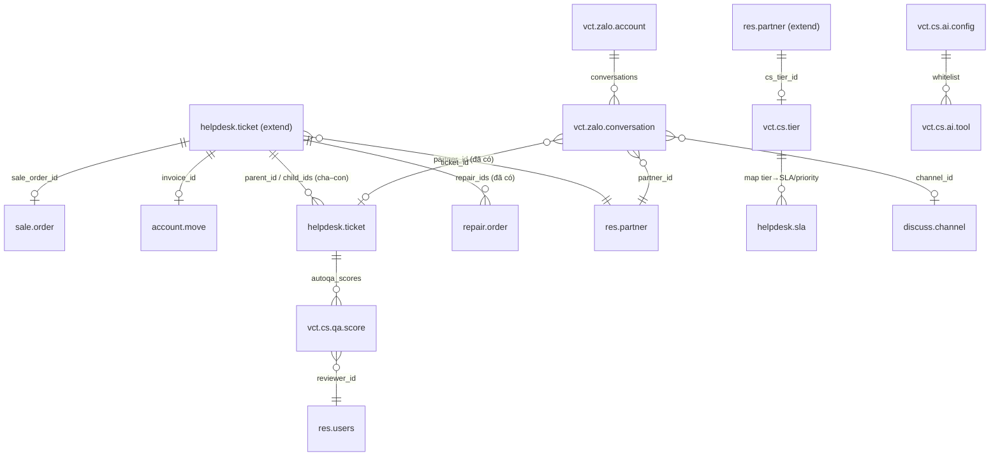

# VCT Customer Service — Tài liệu thiết kế (Phase 0)

> Nền tảng CS "chuẩn hơn Zendesk" cho VCT Platform, **mở rộng Odoo Helpdesk** thay vì
> viết lại. Khác biệt = tích hợp ERP-native + AI + tối ưu thị trường VN.
> Trạng thái: **chờ duyệt Phase 0** → duyệt xong mới code Phase 1.

## 0. Quyết định đã chốt với chủ dự án
| Chủ đề | Chốt |
|---|---|
| Chiến lược build | **Mở rộng `helpdesk` sẵn có** (không dựng ticketing mới) |
| Ưu tiên | Cả 4 differentiator: **360° ERP · Zalo OA · AI tự trả lời · AI Copilot** (xếp tuần tự) |
| LLM | **Hybrid** — Anthropic cloud hướng khách, Ollama local nội bộ |
| Zalo | **Đã có OA + quyền API** (token do chủ dự án nhập — là credential) |

## 1. Hiện trạng codebase (đã khảo sát, DB live `vct-erp-odoo`)
**Đã cài & tái dùng — KHÔNG xây lại (~65% Zendesk):**
- `helpdesk` — `helpdesk.ticket` (partner, priority, stage), **`helpdesk.sla` + `sla.status`** (deadline/fail),
  `helpdesk.team` (gán manual/random/balanced), `helpdesk.tag`, **CSAT rating tích hợp** (`rating_*`).
- `helpdesk_repair` — ticket ↔ `repair.order` đã có (`repair_ids`, `repair_count`).
- `im_livechat` + `website_livechat` — web widget, chatbot, handoff bot↔người, realtime qua `bus.bus`.
- `knowledge` — Knowledge Base (nguồn RAG cho AI).
- `website_helpdesk` + `portal` — cổng khách tạo/xem ticket.
- ERP: `crm`, `sale`, `account` + **`account_followup`** (công nợ), `stock`, `repair`, `industry_fsm` (điều KTV),
  `maintenance`, `project`.
- AI: `vct_llm_assistant` (agent `mail.bot._run_agent`, tool-calling ERP, delete bị chặn cứng),
  `vct_ai_workflow` (node AI + **điều kiện + HTTP** trên `ir.actions.server`), `vct_ai_task` (giao việc/định kỳ).

**Đã có sẵn trên `helpdesk.ticket`:** partner_id, priority, stage_id, team_id, sla_deadline, sla_fail,
sla_status_ids, rating_* , repair_ids/repair_count.
**Chưa có (phần delta cần thêm):** link đơn hàng/hoá đơn, ticket cha–con, panel 360, business-hours VN, unaccent, tier→SLA.

## 2. Kiến trúc module (mỗi phase = 1 module cài được độc lập)
```
vct_helpdesk          (Phase 1) lõi ERP-native: 360 panel, business links, giờ làm VN, unaccent, tier→SLA
  └─ vct_helpdesk_zalo (Phase 2) kênh Zalo OA (webhook in + API out), chat→ticket, handoff
  └─ vct_helpdesk_ai   (Phase 3–4) AI khách (RAG+ERP tools+handoff) · Copilot agent · AutoQA
```
Voice/CTI · WFM · Report-builder · REST API công khai · data-masking = **module tương lai (defer)**.

Nguyên tắc: chỉ `_inherit`/thêm; **không** trùng lặp user/khách/SLA/CSAT đã có.

## 3. Lược đồ dữ liệu (ERD — chỉ phần delta)

**`helpdesk.ticket` (thêm field):** `sale_order_id`, `invoice_id`, `parent_id`+`child_ids`, `related_ticket_ids`;
360 **computed non-stored** (không nhân bản dữ liệu): `partner_due_amount` (công nợ residual), `partner_sale_count`,
`partner_last_order_id`, `partner_ticket_count`, `partner_warranty_state`. **Stored ít** cho routing/SLA: `cs_tier` (related).
**Model mới:** `vct.cs.tier` (hạng KH), `vct.zalo.account`, `vct.zalo.conversation`, `vct.cs.ai.config`,
`vct.cs.ai.tool`, `vct.cs.qa.score`. **Tái dùng:** rating.rating (CSAT), knowledge.article (RAG),
mail.thread/mail.message, discuss.channel/im_livechat, resource.calendar (giờ làm), vct.llm.job (hàng đợi AI).

## 4. Quyết định kiến trúc (phương án + trade-off + đề xuất)
| # | Vấn đề | Phương án & đề xuất |
|---|---|---|
| D1 | Realtime chat | A) `bus.bus`/websocket Odoo (livechat đã dùng) · B) socket.io ngoài · C) polling. **→ A** — 0 hạ tầng mới, đạt <500ms. |
| D2 | Hàng đợi async (AI/email/webhook) | A) tái dùng cron-queue `vct.llm.job` + `ir.cron` + mail queue · B) OCA `queue_job` (Redis) · C) Celery. **→ A ngay** (không thêm dep). `ponytail:` trần ~ vài nghìn job/ngày; vượt thì nâng OCA queue_job (Phase 6). |
| D3 | Kho RAG | A) Postgres FTS + `unaccent` trên knowledge.article · B) `pgvector` + embeddings (Ollama) · C) vector DB ngoài. **→ A trước**, thiết kế interface retriever để B cắm vào (pgvector chưa có trong `postgres:18.4-alpine`). |
| D4 | Hiện dữ liệu 360 | A) computed/related non-stored + panel OWL lazy-load · B) snapshot stored (nhanh lọc nhưng cũ + đồng bộ). **→ A**, chỉ stored vài field cho SLA/routing. |
| D5 | Zalo inbound | Controller `/vct_zalo/webhook` verify chữ ký (secret) → route ticket/livechat; outbound Zalo Open API bằng access_token (tự refresh). Token = credential do chủ dự án nhập. |
| D6 | An toàn AI hướng khách | Bộ tool RIÊNG, **read-only scope theo đúng partner đã xác thực** (đơn/giao/bảo hành/công nợ của CHÍNH KH đó); action ghi (đổi trả/đặt lịch KTV) phải xác nhận + có thể chờ người duyệt; dưới confidence threshold → handoff kèm tóm tắt; log toàn bộ để QA. **Không lazy ở đây** — chặn rò dữ liệu KH khác bằng record-rule + lọc partner_id cứng trong từng tool. |

## 5. API & tích hợp
- `POST /vct_zalo/webhook` — Zalo inbound (verify chữ ký).
- Outbound webhook sự kiện (ticket.created/updated/solved) — tái dùng node **HTTP** của `vct_ai_workflow` + base_automation.
- Portal routes (website_helpdesk) — mở rộng hiển thị dữ liệu ERP của KH.
- REST công khai `/api/v1/*` (ticket/comment/KH) + OAuth/API-key + rate-limit + OpenAPI — **Phase 7** (giờ chỉ chừa chỗ).

## 6. Đặc thị Việt Nam
- `unaccent` (PG extension) → tìm kiếm không dấu; bật + index.
- Giờ làm việc (`resource.calendar`) + **ngày lễ VN** (`resource.calendar.leaves`) cho đồng hồ SLA.
- i18n vi/en (.po), mặc định tiếng Việt.
- Data-masking (CCCD/thẻ/SĐT) theo **NĐ 13/2023/NĐ-CP** + retention — **Phase 7**.
- AI hiểu tiếng Việt tự nhiên/teencode — dùng nhánh cloud của cấu hình Hybrid.

## 7. Lộ trình (mỗi phase: chạy được + test + migration + ghi PROGRESS.md)
| Phase | Module | Kết quả / Demo |
|---|---|---|
| **0** | *(tài liệu)* | DESIGN.md + PROGRESS.md — **cửa duyệt (đang ở đây)** |
| **1** | `vct_helpdesk` | Panel 360° trên ticket (đơn/công nợ/bảo hành/lịch sử ticket) + link đơn/hoá đơn + ticket cha-con + giờ làm VN + unaccent + tier→SLA. Demo: mở ticket thấy toàn cảnh KH 1 màn hình. |
| **2** | `vct_helpdesk_zalo` | Zalo OA 2 chiều, tin nhắn Zalo → ticket/livechat, handoff bot↔người. Demo: nhắn Zalo → ra ticket, agent trả lời về Zalo. |
| **3** | `vct_helpdesk_ai` (agent) | AI khách RAG(KB)+tra cứu ERP theo partner + confidence→handoff + log QA. Demo: khách hỏi trạng thái đơn trên chat, AI trả lời từ ERP, tự chuyển người khi bí. |
| **4** | `vct_helpdesk_ai` (copilot+QA) | Copilot: gợi ý trả lời/tóm tắt/viết lại trên ticket. AutoQA: AI chấm hội thoại, gắn cờ rủi ro. |
| **5+** | *(tương lai)* | Voice/CTI · WFM · report-builder · REST API công khai · data-masking/retention. |

## 8. Rủi ro & phụ thuộc
- **Token Zalo OA**: chủ dự án cấp (credential). Không có → Phase 2 dừng ở adapter + test mock.
- **Key Anthropic (nhánh cloud Hybrid)**: chủ dự án nhập vào Settings. Không có → AI hướng khách chạy tạm bằng Ollama (tiếng Việt yếu hơn).
- **pgvector**: chưa có trong image PG hiện tại → RAG bản đầu dùng FTS+unaccent.
- **Đồng thời với agent khác** sửa cùng addon: build trong module `vct_*` riêng để tránh xung đột.

---
*Duyệt tài liệu này → tôi bắt đầu Phase 1 (`vct_helpdesk`). Chưa code cho tới khi được duyệt.*
